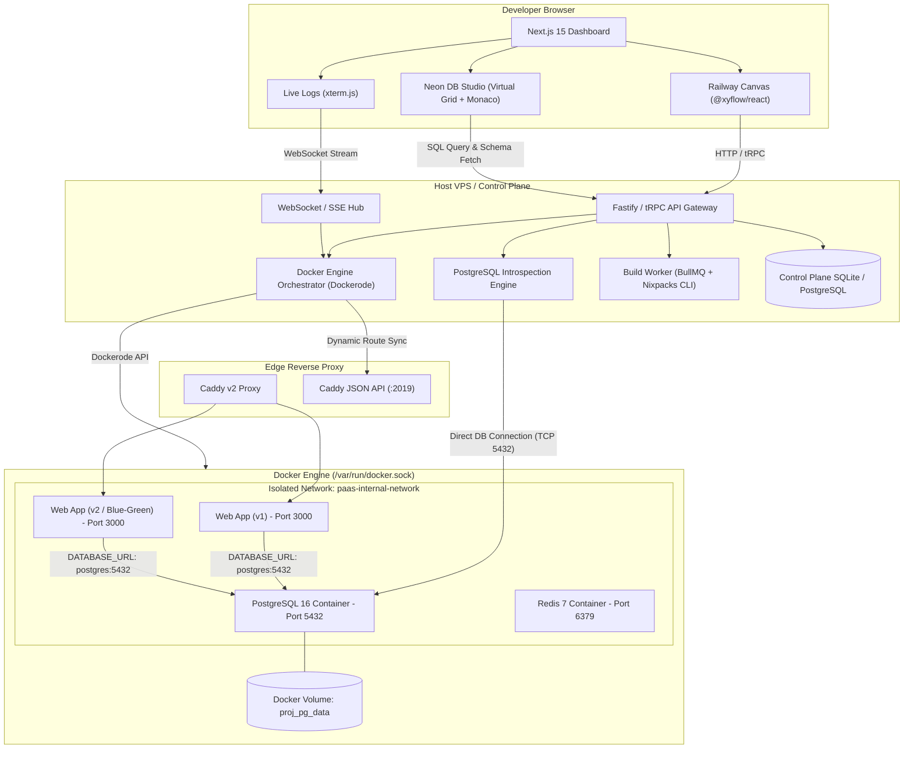

# 01. High-Level System Architecture

This document defines the end-to-end multi-tier architecture of our self-hosted PaaS platform, combining Railway's visual infrastructure canvas with Neon's integrated database table explorer and SQL query runner.

---

## 1. System Topology Overview

The platform is divided into four distinct planes:
1. **Presentation Plane (Next.js 15 App Router & React 19)**:
   - Visual service topology canvas built on `@xyflow/react`.
   - Neon-style database studio (virtualized data grid, Monaco SQL editor, schema browser).
   - Real-time terminal log viewer powered by `@xterm/xterm`.
   - Metrics dashboards (CPU, RAM, Disk, Network I/O).

2. **Control Plane (Fastify / NestJS / tRPC Daemon)**:
   - Container orchestration engine interfacing directly with `/var/run/docker.sock` via `dockerode`.
   - Dynamic service topology resolver and cross-service environment variable interpolator.
   - Dynamic database connection pooler and schema introspection engine.
   - Job queue (BullMQ + Redis) for asynchronous repository cloning, Nixpacks compilation, and container rollouts.

3. **Execution Plane (Docker Engine on Host VPS)**:
   - User application containers (Node.js, Next.js, Python, Go, Rust, Dockerfile apps).
   - Managed database containers (PostgreSQL 16, Redis, MySQL) backed by isolated Docker volumes.
   - Isolated internal bridge network (`paas-internal-network`) providing inter-service DNS resolution.

4. **Edge Routing Plane (Caddy v2 Server)**:
   - Dynamic HTTP reverse proxy controlled via Caddy's dynamic JSON REST API (`http://localhost:2019`).
   - Automated SSL/TLS issuance and renewal through Let's Encrypt / ZeroSSL without server restarts.
   - Zero-downtime routing swaps during Blue/Green deployments.

---

## 2. End-to-End Architectural Diagram



---

## 3. Communication Protocols

| Link | Protocol | Purpose | Latency Target |
| :--- | :--- | :--- | :--- |
| **Frontend ↔ Control Plane** | HTTP/2 (tRPC / REST) | Canvas state, project CRUD, config updates | < 50ms |
| **Frontend ↔ Live Logs** | WebSockets (RFC 6455) | Streaming stdout/stderr chunks to xterm.js | < 20ms |
| **Frontend ↔ DB Table Editor** | tRPC (Paginated JSON) | Loading schema, virtualized rows, cell updates | < 100ms |
| **Control Plane ↔ Docker** | Unix Domain Socket | Inspecting, creating, stopping containers | < 10ms |
| **Control Plane ↔ Caddy** | HTTP/1.1 REST (`:2019`) | Updating route handlers and upstream IPs | < 5ms |
| **Control Plane ↔ Postgres** | PostgreSQL Native Wire (pg) | Catalog queries, user queries, cell updates | < 10ms |
| **Edge Proxy ↔ App Containers** | HTTP/1.1 & HTTP/2 | Incoming public web traffic reverse proxying | < 2ms |

---

## 4. Multi-Tenant Project Hierarchy

To match Railway's organization, data is structured as follows:

```
Organization / User Account
└── Project (e.g. "E-Commerce App")
    ├── Environment (e.g. "Production", "Staging", "PR-42")
    │   ├── Network: "proj_<id>_<env>_net"
    │   │
    │   ├── Service: "api-backend"
    │   │   ├── Type: Web Service (Nixpacks / Dockerfile)
    │   │   ├── Deployments: [v1 (Active), v2 (Building)]
    │   │   ├── Env Vars: [PORT=3000, DATABASE_URL=${{ postgres.DATABASE_URL }}]
    │   │   └── Routes: ["api.myplatform.com"]
    │   │
    │   ├── Service: "postgres"
    │   │   ├── Type: Database (PostgreSQL 16)
    │   │   ├── Volume: "proj_<id>_<env>_pgdata"
    │   │   ├── Metadata: Tables, Columns, Indexes (cached)
    │   │   └── Env Vars: [POSTGRES_DB, POSTGRES_USER, POSTGRES_PASSWORD]
    │   │
    │   └── Service: "redis"
    │       ├── Type: Database (Redis 7)
    │       └── Env Vars: [REDIS_PASSWORD, REDIS_URL]
    │
    └── Canvas Layout State:
        ├── Nodes: [{ id: "api-backend", x: 100, y: 150 }, { id: "postgres", x: 450, y: 150 }]
        └── Edges: [{ id: "edge-1", source: "postgres", target: "api-backend" }]
```

---

## 5. Key System Workflows

### 5.1 Service Creation via Visual Canvas
1. User clicks **"New Service"** on the canvas or drags a template (e.g. Postgres or GitHub Repo).
2. Canvas updates locally with an optimistic node showing an `Initializing` badge.
3. Frontend issues `services.create` tRPC mutation.
4. If **Database**:
   - Control plane generates cryptographically random credentials.
   - Control plane provisions named Docker volume.
   - Container is spawned on `paas-internal-network`.
   - Control plane initializes connection pooler and introspects the newly initialized database.
5. If **GitHub Repo / Web Service**:
   - Build worker triggers a Nixpacks build task.
   - Live build logs stream via WebSockets to the client's terminal.
   - Upon image build completion, container starts, passes health check, and registers with Caddy.

### 5.2 Neon-Style Table Exploration Workflow
1. User clicks on the **Postgres** node on the canvas.
2. A slide-over panel opens with tabs: **Overview**, **Variables**, **Metrics**, and **Data Studio** (the Neon Table Viewer).
3. The Data Studio requests the database schema via `database.getIntrospection({ serviceId })`.
4. The backend queries PostgreSQL's `pg_catalog` and `information_schema` to return table names, column names, data types, primary keys, and foreign keys.
5. User selects a table (e.g., `users`).
6. Frontend requests rows via virtualized pagination: `database.getTableRows({ serviceId, table: 'users', limit: 50, offset: 0 })`.
7. User edits a cell inline or executes custom SQL in the Monaco editor.
8. Backend executes the modification inside a managed transaction and returns the updated state.
